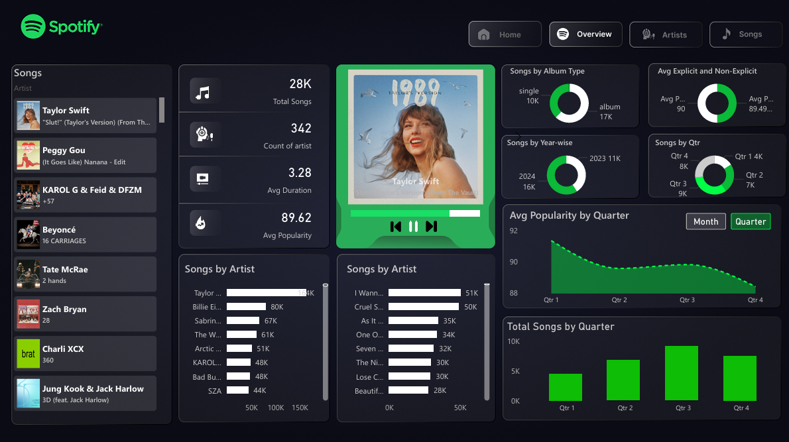

# Spotify Top-50 World Dashboard (Power BI)

---

## Overview

This repository contains an **advanced Power BI dashboard** built using **Spotify Global Top-50 chart data**.  
The report focuses on **song performance, artist dominance, popularity efficiency, and release strategy**, using **measure-driven DAX logic** and **Spotify-inspired UI design**.

The project demonstrates:
- Advanced DAX modeling
- Analytical visual design
- Interactive, multi-page reporting
- Real-world BI dashboard standards

---

## Report Structure (4 Pages)

### 1. Home / Overview
High-level KPIs and chart-level trends.

**Key Elements**
- Total Songs, Average Popularity, Average Duration, Artist Count
- Songs by Album Type (Single vs Album)
- Explicit vs Non-Explicit comparison
- Songs by Year & Quarter
- Average Popularity trend by Quarter
- Total Songs by Quarter
- Dynamic album artwork preview

---

### 2. Artists Analysis
Focuses on **artist dominance and consistency**.

**Key Elements**
- Songs by Artist (ranked)
- Artist Consistency Index
- Artist-level performance table:
  - Count of tracks
  - Avg duration
  - Songs per artist
  - Avg & Max popularity
- Interactive artist filtering

---

### 3. Songs Analysis
Song-level performance and efficiency analysis.

**Key Elements**
- Songs by Popularity per Minute
- Songs by Top Chart Appearances
- Song-level metrics table:
  - Avg popularity
  - Longest / shortest duration
- Album artwork synced with song selection

---

### 4. Navigation & UX Design
Consistent navigation and Spotify-style layout across pages.

**Design Highlights**
- Dark theme UI
- Spotify green accent color
- Card-based layout
- Minimal gridlines and visual noise
- Page navigation buttons (Home / Overview / Artists / Songs)

---

## DAX & Modeling Approach

- **Measure-first design** (no calculated columns for insights)
- Context-aware measures for correct slicing and filtering
- Reusable KPI measures across pages
- Optimized aggregation logic for performance

### Measure Categories
- Base metrics (counts, averages)
- Popularity & volatility
- Rank & top-appearance analysis
- Duration efficiency
- Explicit vs non-explicit comparison
- Album & release strategy
- Artist consistency

All visuals are driven entirely by **DAX measures**, ensuring scalability and correctness.

---

## Tools & Technologies

- **Power BI Desktop**
- **DAX (Advanced Measures)**
- **Data Modeling**
- **Custom Visual Formatting**
- **GitHub (Version Control & Documentation)**

---

## How to Use

1. Clone the repository
2. Open the `.pbix` file in Power BI Desktop
3. Use slicers and selections to explore:
   - Artists
   - Songs
   - Time periods
4. Navigate across pages using built-in buttons

---

## Notes

- This project is intended for **portfolio and learning purposes**
- Spotify branding is used only for **visual inspiration**
- No official affiliation with Spotify

---

## Author

Developed by **Vaibhav Verma**  
Advanced Power BI | DAX | Analytics

---

## License

MIT License
